# Personalised Skincare Recommendation System 

## Executive Summary
### Business Challenge
The business challenge addressed was the lack of personalised skincare product recommendations, which often result in users buying products that do not adequately meet their needs. Many consumers face difficulties in finding suitable skincare products due to generic and one-size-fits-all recommendations. The hypothesis was that by leveraging user-specific data and clustering techniques, a recommendation engine could deliver more accurate and personalised skincare suggestions. This project, therefore, aimed to develop a personalised skincare recommendation app that caters to individual skin characteristics. At the heart of this app is a recommendation engine, designed with a structured logic workflow (see Figure 1) to provide tailored skincare suggestions.

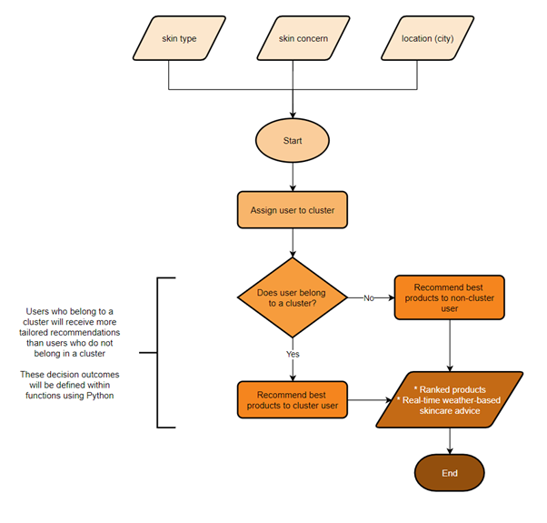

Figure 1. Recommendation Engine Logic Workflow.

### Methods - Data Collection
The following data was used:
(1)	[Sephora product review data from Kaggle](https://www.kaggle.com/datasets/nadyinky/sephora-products-and-skincare-reviews)
(2)	Synthetic user data from Mockaroo
(3)	Real-time weather data from the OpenWeatherMap API

### Methods - Data Processing
Data processing involved quality checks, cleaning, merging, and feature engineering using Python. Exploratory Data Analysis (EDA) was conducted on the Sephora and synthetic user datasets to understand the underlying patterns.

### Methods - Data Analysis
K-modes clustering was applied to the synthetic user data to group users with similar skin characteristics (e.g., skin type and skin concern). The analysis was conducted using Python.

### Results
Three clusters were identified, each with unique profiles characterised by specific skin types (e.g., dry), concerns (e.g., aging), and preferred ingredients (e.g., retinol). These profiles guided the recommendation engine in filtering products, leading to the development of an app that offers personalised skincare recommendations.

### Conclusion
The app performs well but could benefit from integrating more environmental factors and regular updates to the clustering model. Future expansions should focus on incorporating additional data, such as products from other retailers, and refining the recommendation accuracy.

##  Data Preparation
The project adhered to Extract, Transform, and Load (ETL) standards throughout the data preparation stage, ensuring a systematic and efficient process.(1) An ETL workflow was planned and developed to guide data collection, cleaning, transformation, and loading (see Figure 2).

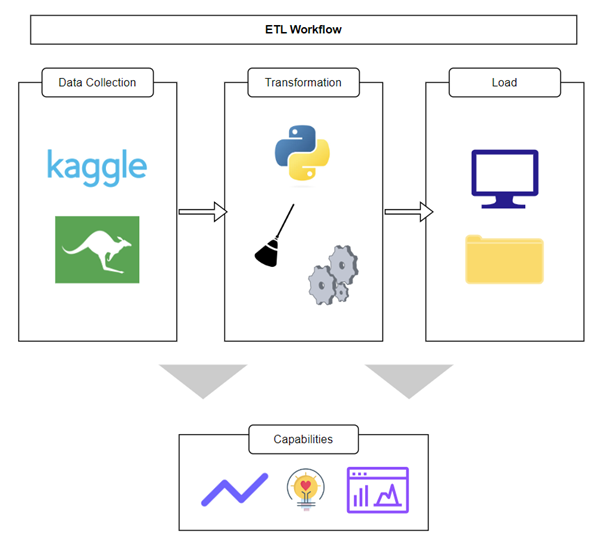

Figure 2. Diagram of the ETL pipeline. Capabilities include analytics, insights, and visualisations.

### Data Collection

The first stage involved data collection and extraction, which included downloading the publicly available Sephora product review dataset from Kaggle and generating synthetic user data from Mockaroo. The Sephora dataset comprised five review CSV files and one product information CSV file. This data was processed first to inform the unique values needed for the synthetic user data columns. Once the Sephora data was processed, synthetic user data was generated using Mockaroo, a versatile online tool for creating realistic fake datasets.(2) Six fields were defined to create the desired dataset (see Figure 3). The "primary_skin_concern" column was weighted using skin concerns data from Statista to reflect real-world nuances accurately.(3)

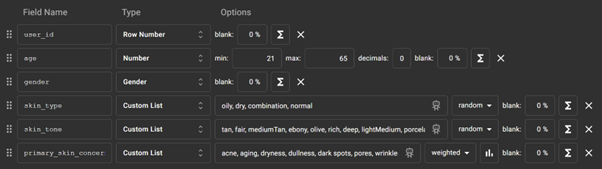

Figure 3. Screenshot of data fields created in Mockaroo for the synthetic data.

### Data Transformation
Preparing the Sephora dataset involved several steps:
1.	Missing data and duplicates: Identifying and handling missing data and duplicates to ensure data integrity
2.	Data merging: Integrating product information with reviews using the “product_id” key
3.	Column Filtering: Removing unwanted columns through a lookup process
4.	Text Processing: Processing text in specific columns, such as ingredients

The same data quality checks were repeated for the user data. Data quality was a critical focus, aligning with best practices in data engineering and ETL to optimise output accuracy and reliability.(1,4) 

Feature engineering, a method used by data scientists to enrich a dataset and gain deeper understanding of the data at hand, was used to create new features in the Sephora dataset.(5) An example of this was the creation of a popularity score, calculated by multiplying the loves count by the rating for each product. This score was then normalised using min-max scaling to produce a value between 0 and 1.

Upon review, it was determined that age, gender, and skin type were irrelevant for the clustering analysis. Including these features could introduce biases, as the Sephora dataset lacks personal demographic information. Thus, focusing on skin type, skin concerns and product attributes ensured relevance and accuracy.

### Exploratory Data Analysis
Multiple charts were plotted in Python to explore the Sephora data.
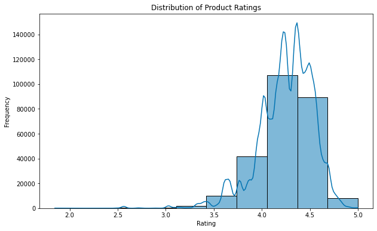
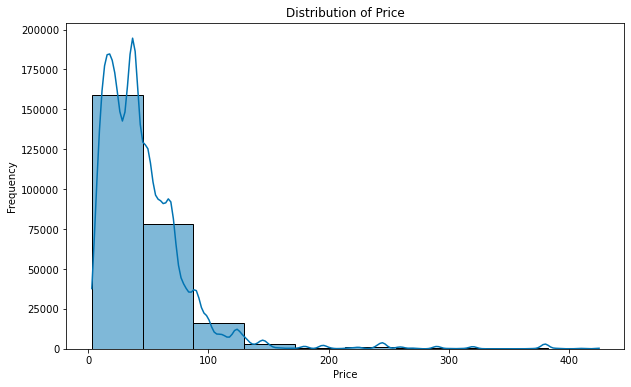
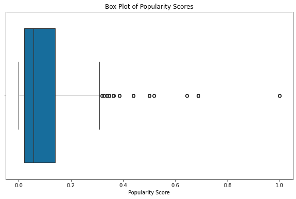
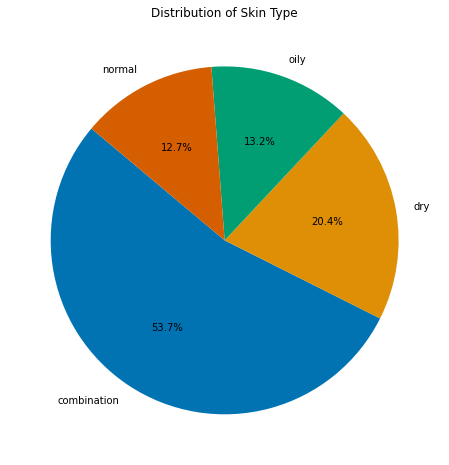
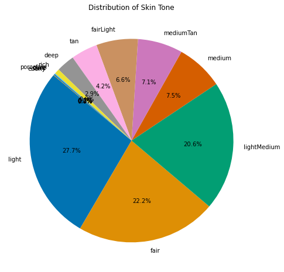
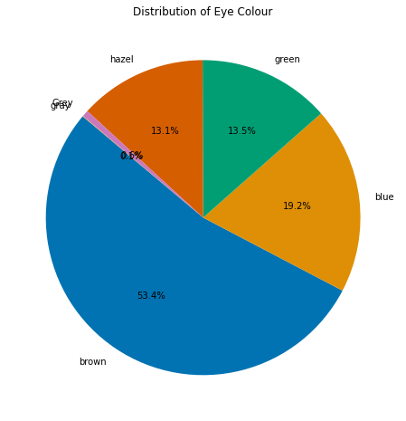
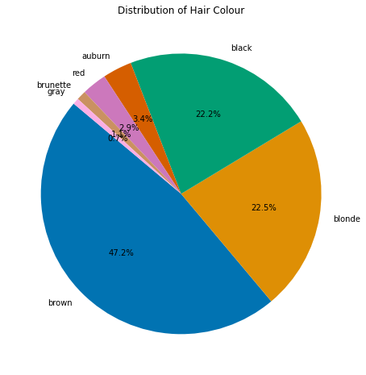
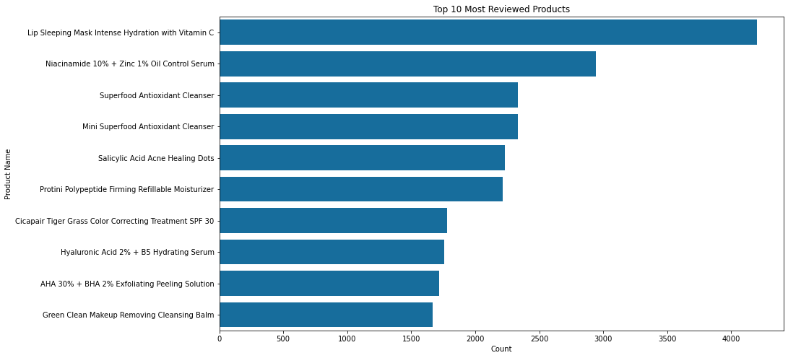
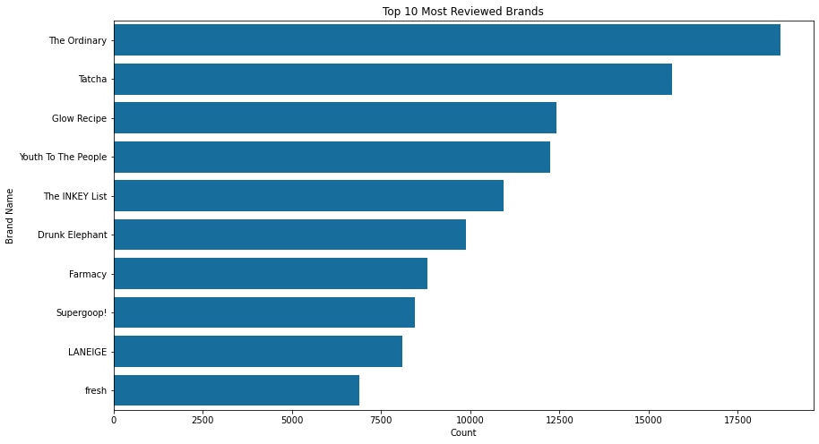
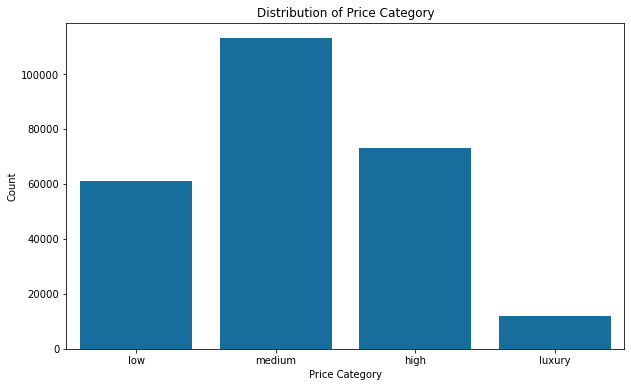
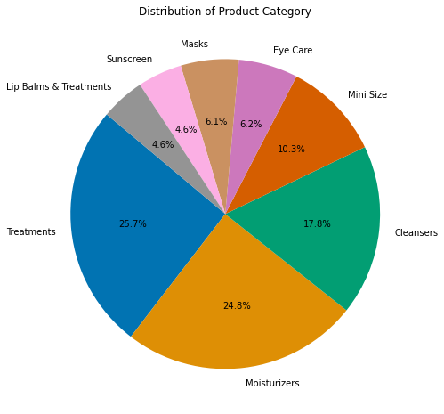
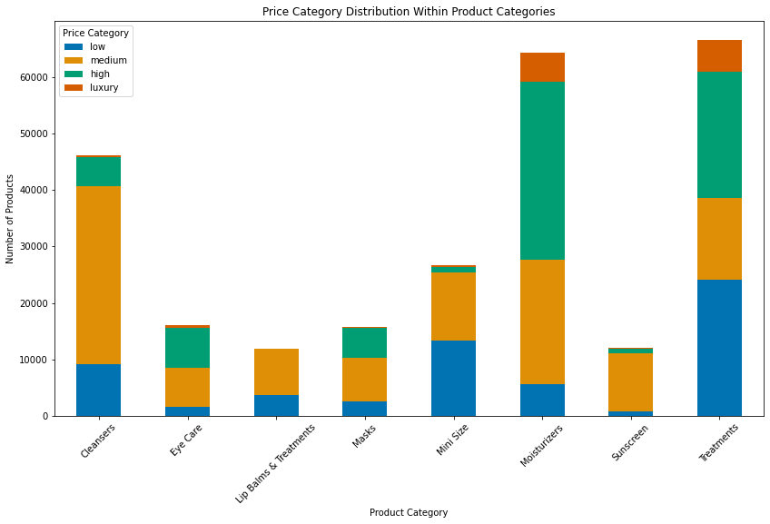
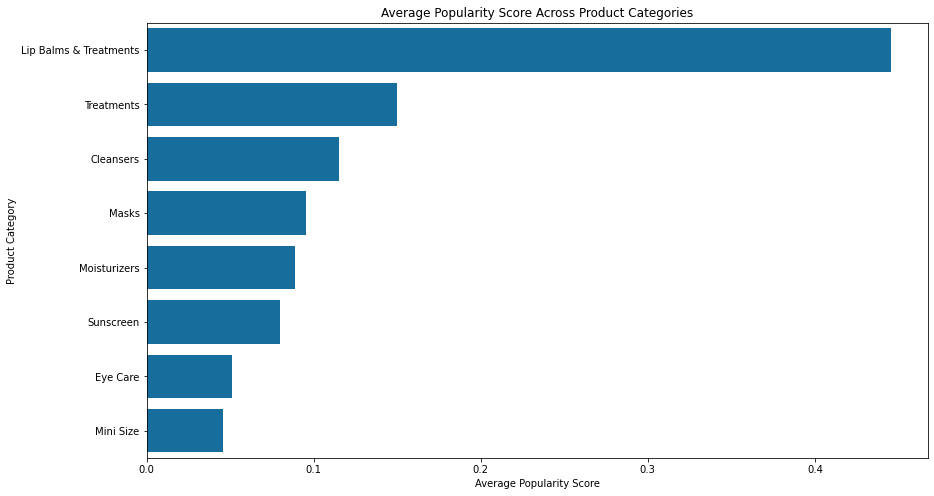
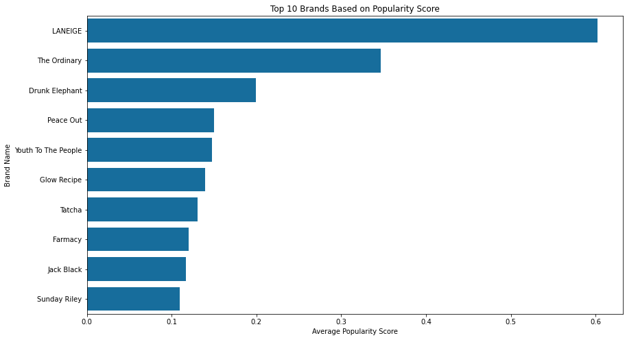
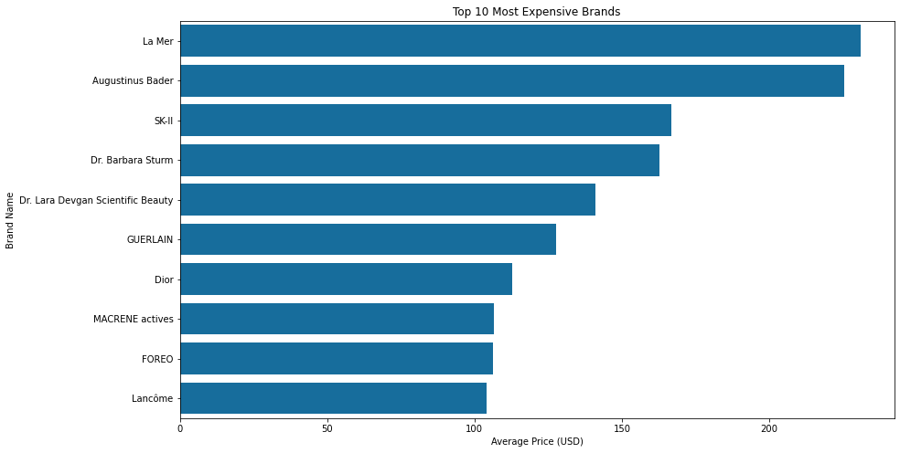
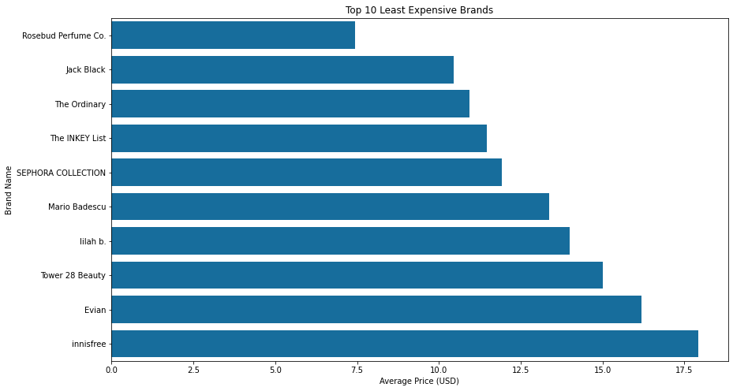
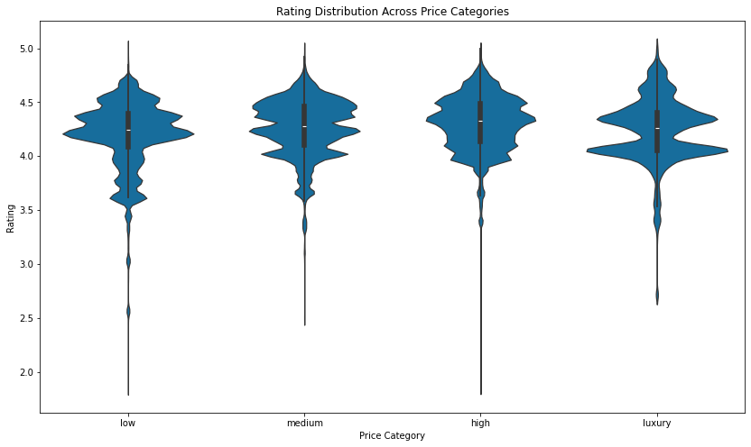
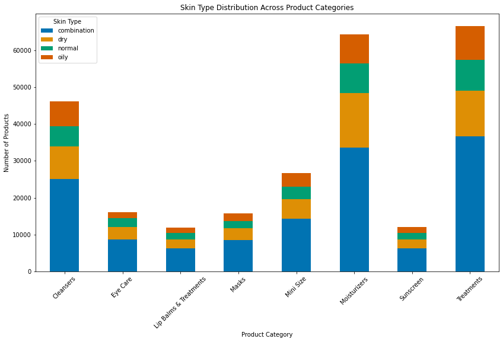
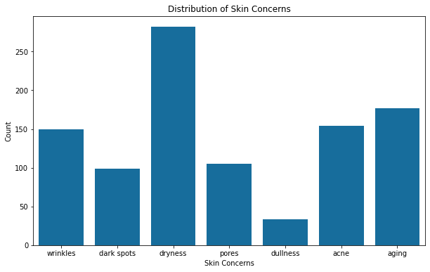
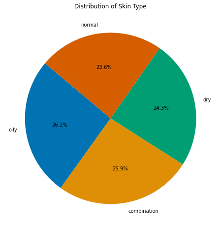
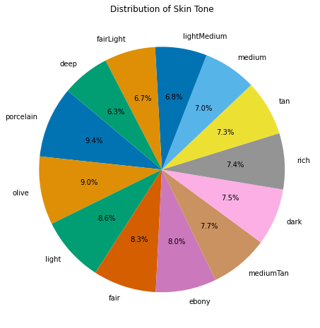

### Data Loading
Both the Sephora and synthetic user datasets were securely stored in a structured system on the local PC. Real-time weather data from the OpenWeatherMap API was extracted during app usage, providing up-to-date humidity levels for weather-based skincare advice.

## Data Analysis
### K-modes Clustering
Initially, one-hot encoding was planned to convert the categorical variables from the synthetic user data into binary variables for k-means clustering. However, research revealed that k-modes clustering, which directly handles categorical variables, was a more suitable approach.(6,7) Unlike k-means, k-modes clustering measures dissimilarities between data points and uses the mode instead of the mean.(7) Python's Kmodes library provided built-in functions to facilitate this clustering method. 
With k-modes, the cost is defined as the sum of dissimilarities, replacing the sum of squared distances used in k-means.(7) To determine the optimal number of clusters (k), the elbow method was applied, informing the model on the appropriate number of clusters to identify within the user dataset (see Figure 4). The resulting model with three clusters was then integrated with the user dataset for use in the recommendation engine. 

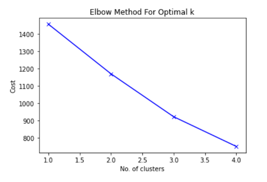

Figure 4. Elbow Chart showing Optimal k.

Validation is significant in statistical techniques, but it presents challenges in k-modes clustering due to the absence of truth labels in the data. The adjusted rand index (ARI) is typically used to measure cluster similarity, but it was inapplicable here due to the synthetic nature of the data and lack of predefined skincare groups.(8) Nonetheless, the elbow method provided a form of validation by optimising k and reducing cost.

The subsequent step involved matching skin concerns and types with product descriptions in the Sephora dataset. A dictionary was created to map skin concerns and types to keywords from the product “highlights” column. For instance, keywords related to "acne" included acne, blemish, spots, spot, clear, clean, and pimple. Products containing these keywords were tagged in the "skin_concern_addressed" column.

### Cluster Profiling

### Data Quality and Governance

### Infrastructure and Tools

## References
1. [The Power of ETL Piplines Tools and Best Practices](https://medium.com/@xhackfuel/the-power-of-etl-pipelines-tools-and-best-practices-e419688882b8)
2. [Mockaroo to the Rescue](https://plgah.medium.com/need-synthetic-data-mockaroo-to-the-rescue-e9c8159b0d9f)
3. [Most Common Skin Concerns among US Skincare Shoppers by Generation](https://www.statista.com/statistics/1334325/most-common-skin-concerns-among-us-skin-care-shoppers-by-generation/)
4. [ETL Best Practices](https://www.precisely.com/blog/big-data/etl-best-practices)
5. [What is Feature Engineering?](https://towardsdatascience.com/what-is-feature-engineering-bfd25b2b26b2)
6. [How to Handle Categorical Variables in Clustering](https://medium.com/@tarek.tm/how-to-handle-categorical-variables-in-clustering-1daa3b05bf25)
7. [Kmodes Clustering Algorithm for Categorical Data](https://www.analyticsvidhya.com/blog/2021/06/kmodes-clustering-algorithm-for-categorical-data/)
8. [Ref8](https://onlinelibrary.wiley.com/doi/full/10.1002/sam.11546)
