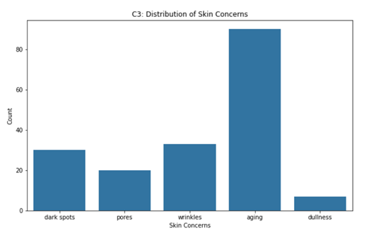
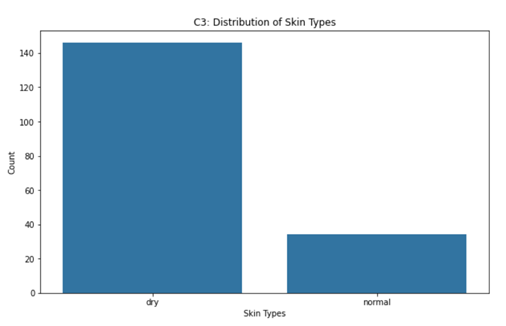
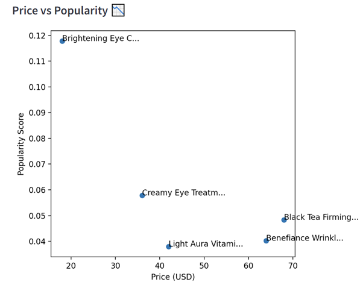
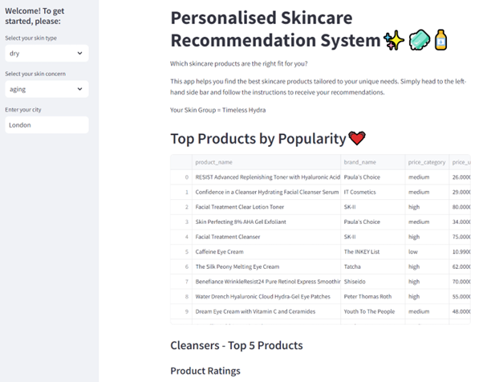

# Personalised Skincare Recommendation System 

## Executive Summary
### Business Challenge
The business challenge addressed was the lack of personalised skincare product recommendations, which often result in users buying products that do not adequately meet their needs. Many consumers face difficulties in finding suitable skincare products due to generic and one-size-fits-all recommendations. The hypothesis was that by leveraging user-specific data and clustering techniques, a recommendation engine could deliver more accurate and personalised skincare suggestions. This project, therefore, aimed to develop a personalised skincare recommendation app that caters to individual skin characteristics. At the heart of this app is a recommendation engine, designed with a structured logic workflow (see Figure 1) to provide tailored skincare suggestions.

Figure 1. Recommendation Engine Logic Workflow.

### Methods - Data Collection
The following data was used:
(1)	[Sephora product review data from Kaggle](https://www.kaggle.com/datasets/nadyinky/sephora-products-and-skincare-reviews)
(2)	Synthetic user data from Mockaroo
(3)	Real-time weather data from the OpenWeatherMap API

### Methods - Data Processing
Data processing involved quality checks, cleaning, merging, and feature engineering using Python. Exploratory Data Analysis (EDA) was conducted on the Sephora and synthetic user datasets to understand the underlying patterns.

### Methods - Data Analysis
K-modes clustering was applied to the synthetic user data to group users with similar skin characteristics (e.g., skin type and skin concern). The analysis was conducted using Python.

### Results
Three clusters were identified, each with unique profiles characterised by specific skin types (e.g., dry), concerns (e.g., aging), and preferred ingredients (e.g., retinol). These profiles guided the recommendation engine in filtering products, leading to the development of an app that offers personalised skincare recommendations.

### Conclusion
The app performs well but could benefit from integrating more environmental factors and regular updates to the clustering model. Future expansions should focus on incorporating additional data, such as products from other retailers, and refining the recommendation accuracy.

##  Data Preparation
The project adhered to Extract, Transform, and Load (ETL) standards throughout the data preparation stage, ensuring a systematic and efficient process.(1) An ETL workflow was planned and developed to guide data collection, cleaning, transformation, and loading (see Figure 2).

Figure 2. Diagram of the ETL pipeline. Capabilities include analytics, insights, and visualisations.

### Data Collection

The first stage involved data collection and extraction, which included downloading the publicly available Sephora product review dataset from Kaggle and generating synthetic user data from Mockaroo. The Sephora dataset comprised five review CSV files and one product information CSV file. This data was processed first to inform the unique values needed for the synthetic user data columns. Once the Sephora data was processed, synthetic user data was generated using Mockaroo, a versatile online tool for creating realistic fake datasets.(2) Six fields were defined to create the desired dataset (see Figure 3). The "primary_skin_concern" column was weighted using skin concerns data from Statista to reflect real-world nuances accurately.(3)

Figure 3. Screenshot of data fields created in Mockaroo for the synthetic data.

### Data Transformation
Preparing the Sephora dataset involved several steps:
1.	Missing data and duplicates: Identifying and handling missing data and duplicates to ensure data integrity
2.	Data merging: Integrating product information with reviews using the “product_id” key
3.	Column Filtering: Removing unwanted columns through a lookup process
4.	Text Processing: Processing text in specific columns, such as ingredients

The same data quality checks were repeated for the user data. Data quality was a critical focus, aligning with best practices in data engineering and ETL to optimise output accuracy and reliability.(1,4) 

Feature engineering, a method used by data scientists to enrich a dataset and gain deeper understanding of the data at hand, was used to create new features in the Sephora dataset.(5) An example of this was the creation of a popularity score, calculated by multiplying the loves count by the rating for each product. This score was then normalised using min-max scaling to produce a value between 0 and 1.

Upon review, it was determined that age, gender, and skin type were irrelevant for the clustering analysis. Including these features could introduce biases, as the Sephora dataset lacks personal demographic information. Thus, focusing on skin type, skin concerns and product attributes ensured relevance and accuracy.

### Exploratory Data Analysis
Multiple charts were plotted in Python to explore the Sephora data.

### Data Loading
Both the Sephora and synthetic user datasets were securely stored in a structured system on the local PC. Real-time weather data from the OpenWeatherMap API was extracted during app usage, providing up-to-date humidity levels for weather-based skincare advice.

## Data Analysis
### K-modes Clustering
Initially, one-hot encoding was planned to convert the categorical variables from the synthetic user data into binary variables for k-means clustering. However, research revealed that k-modes clustering, which directly handles categorical variables, was a more suitable approach.(6,7) Unlike k-means, k-modes clustering measures dissimilarities between data points and uses the mode instead of the mean.(7) Python's Kmodes library provided built-in functions to facilitate this clustering method. 
With k-modes, the cost is defined as the sum of dissimilarities, replacing the sum of squared distances used in k-means.(7) To determine the optimal number of clusters (k), the elbow method was applied, informing the model on the appropriate number of clusters to identify within the user dataset (see Figure 4). The resulting model with three clusters was then integrated with the user dataset for use in the recommendation engine. 

Figure 4. Elbow Chart showing Optimal k.

Validation is significant in statistical techniques, but it presents challenges in k-modes clustering due to the absence of truth labels in the data. The adjusted rand index (ARI) is typically used to measure cluster similarity, but it was inapplicable here due to the synthetic nature of the data and lack of predefined skincare groups.(8) Nonetheless, the elbow method provided a form of validation by optimising k and reducing cost.

The subsequent step involved matching skin concerns and types with product descriptions in the Sephora dataset. A dictionary was created to map skin concerns and types to keywords from the product “highlights” column. For instance, keywords related to "acne" included acne, blemish, spots, spot, clear, clean, and pimple. Products containing these keywords were tagged in the "skin_concern_addressed" column.

### Cluster Profiling
Exploratory Data Analysis (EDA) was used to define profiles for each cluster based on predominant characteristics in each cluster (refer to Figure 5 and Figure 6 as an example). Additionally, research was conducted to identify the preferred ingredients for each group, determining the most effective ingredients for the skin concerns specific to each cluster. The significant increase in people concerned about skin product ingredients makes this step particularly important.(9)

Figure 5. Distribution of Skin Concerns in Cluster No. 3 (C3). Aging is clearly the predominant skin concern in C3.

Figure 6. Distribution of Skin Types in Cluster No. 3 (C3). Dry is the main skin type in C3.

### Data Quality and Governance
Ethical considerations were central to the analysis, addressing potential biases and privacy concerns. The use of synthetic data avoided data privacy concerns as part of the Data Protection Act 2018, and efforts were made to reduce biases by excluding irrelevant demographic variables. The project’s alignment with legal and regulatory obligations ensures responsible data handling, including vigorous data quality checks. Both manual inspection and automated checks (via Python) were used to effectively assess data quality dimensions (e.g., completeness, consistency, and uniqueness).(10)

### Infrastructure and Tools
Python was selected as the primary programming language for this project due to its extensive libraries for data manipulation and analysis. Its readability, often described as English-like, was particularly beneficial for a beginner like myself. Key libraries such as Pandas, Matplotlib, and Kmodes offered essential functions for data processing, visualization, and k-modes clustering, which were crucial to the project's success.(11,12) 

The Integrated Development Environment (IDE) chosen was Spyder, similar to RStudio, an IDE I am familiar with from my workplace.(13) Spyder's interactivity, including its real-time code execution in the console, was vital for ensuring data processing tasks were correctly coded to clean, format, and create new features. Additionally, Spyder's environment allows for thorough data exploration, such as visualising data frames, sorting values in columns, and performing general sense-checks.(14) 

Although R was considered as an alternative language, the need for a dashboard or app led to the preference for Python, based on recommendations from colleagues. Python’s compatibility with Streamlit, a library designed to turn scripts into web apps, was a significant factor. Streamlit supports the development of user interfaces and integrates seamlessly with other Python libraries used in this project, making it ideal for creating the skincare recommendation app.(15) 
While Streamlit has limitations in terms of web app customisability compared to other libraries like Dash, it excels in simplicity and ease of use. This simplicity was advantageous for laying down the foundation for an insightful app. Despite its basic design capabilities, Streamlit enabled the efficient development of a functional and user-friendly skincare recommender.(16)

This choice of infrastructure and tools ensured a robust and scalable solution, aligning with the project's goals in supporting its successful execution.

## Data Visualisaitons and Dashboards
Throughout the project, data visualisation was key for communicating insights effectively. Visuals in Python and charts in the Streamlit app were used to present key findings to users with specific skin concerns. For instance, the elbow method chart illustrated the optimal number of clusters, while scatter charts depicted product popularity versus price for the top 5 ranked products, based on the popularity score, aiding users in making informed purchase decisions (see Figure 7). These visuals were designed with skincare consumers in mind, ensuring they were both relevant and easy to understand. UX design principles, such as visual hierarchy (prioritising important information) and consistency (using uniform styles), were applied to ensure clarity, simplicity, and logical flow.(17) This approach effectively conveyed data in an accessible and user-friendly manner (See Figure 8).

Figure 7. Scatter chart for Price vs Popularity on the top 5 ranked products in the Eye Care category.

Figure 8. Screenshot of the app demonstrating UX principles (e.g., visual hierarchy and consistency).

## Discussion and Conclusion
While the app showed promise in delivering personalised skincare recommendations, there were limitations that need addressing. The reliance on synthetic user data, which lacks the complexity and variability of real-world data, affected the accuracy of the clusters and the recommender's effectiveness. Future work should focus on collecting the real user data and updating the clustering model regularly, ensuring the recommendations remain accurate and relevant. However, collecting user data presents challenges, including high costs, time consumption, and significant resource demands for collection, processing, and storage. Additionally, the voluntary nature of data submission could introduce biases, potentially skewing the results. One approach to mitigate these issues is to start with a smaller, more manageable dataset and progressively refine the model as more data becomes available. 

The recommender could also benefit from incorporating additional environmental factors such as change in temperature, which has been reported to influence skin conditions.(18,19) Expanding the data sources to include products from other retailers would also enhance the app’s usefulness by offering a broader range of products.

In conclusion, this project successfully produced an app for personalised skincare recommendations based on user input. While the current app provides useful suggestions and insights, future iterations should incorporate real user data to improve the clustering model.

## References
1. [The Power of ETL Piplines Tools and Best Practices](https://medium.com/@xhackfuel/the-power-of-etl-pipelines-tools-and-best-practices-e419688882b8)
2. [Mockaroo to the Rescue](https://plgah.medium.com/need-synthetic-data-mockaroo-to-the-rescue-e9c8159b0d9f)
3. [Most Common Skin Concerns among US Skincare Shoppers by Generation](https://www.statista.com/statistics/1334325/most-common-skin-concerns-among-us-skin-care-shoppers-by-generation/)
4. [ETL Best Practices](https://www.precisely.com/blog/big-data/etl-best-practices)
5. [What is Feature Engineering?](https://towardsdatascience.com/what-is-feature-engineering-bfd25b2b26b2)
6. [How to Handle Categorical Variables in Clustering](https://medium.com/@tarek.tm/how-to-handle-categorical-variables-in-clustering-1daa3b05bf25)
7. [Kmodes Clustering Algorithm for Categorical Data](https://www.analyticsvidhya.com/blog/2021/06/kmodes-clustering-algorithm-for-categorical-data/)
8. [Ref8](https://onlinelibrary.wiley.com/doi/full/10.1002/sam.11546)
9. [It Skincare Ingredients](https://www.wellandgood.com/it-skin-care-ingredients/)
10. [Meet the Data Quality Dimensions](https://www.gov.uk/government/news/meet-the-data-quality-dimensions)
11. [Advantages of Python over Other Programming Languages](https://www.analyticsvidhya.com/blog/2024/01/advantages-of-python-over-other-programming-languages/)
12. [Python Preferred Languages Data Science](https://www.kdnuggets.com/2020/01/python-preferred-languages-data-science.html)
13. [Pycharm vs Spyder](https://www.bestcolleges.com/pycharm-vs-spyder-which-should-you-use/)
14. [Spyder Everything You Need to Know About The Python IDE for Data Science](https://datascientest.com/en/spyder-everything-you-need-to-know-about-the-python-ide-for-data-science)
15. [Building Dashboards and Data Apps with Streamlit](https://medium.com/dp6-us-blog/building-dashboards-and-data-apps-with-streamlit-e1217cd3f00a)
16. [Data Dashboarding Streamlit vs Dash vs Shiny vs Voila](https://www.datarevenue.com/en-blog/data-dashboarding-streamlit-vs-dash-vs-shiny-vs-voila)
17. [Top 10 UX Design Principles for Superior User Experience](https://www.studio14online.co.uk/top-10-ux-design-principles-for-superior-user-experience/)
18. [How Season Weather Affect Skin](https://www.allure.com/story/how-seasons-weather-affect-skin)
19.	[How Your Skin Changes with The Seasons](https://cambridgelaserclinic.com/how-your-skin-changes-with-the-seasons/)
